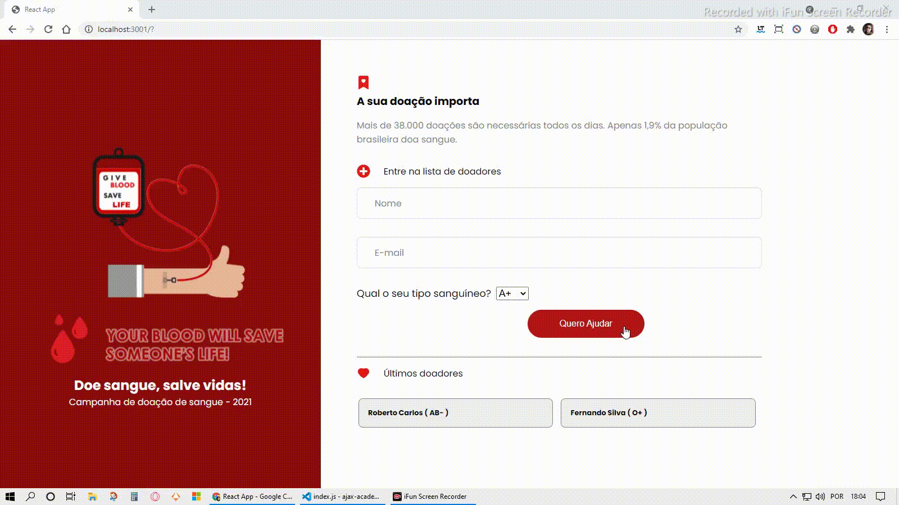
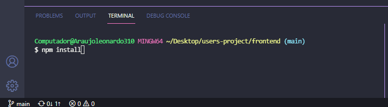
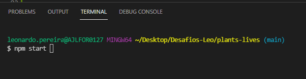
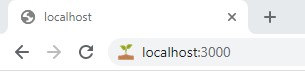
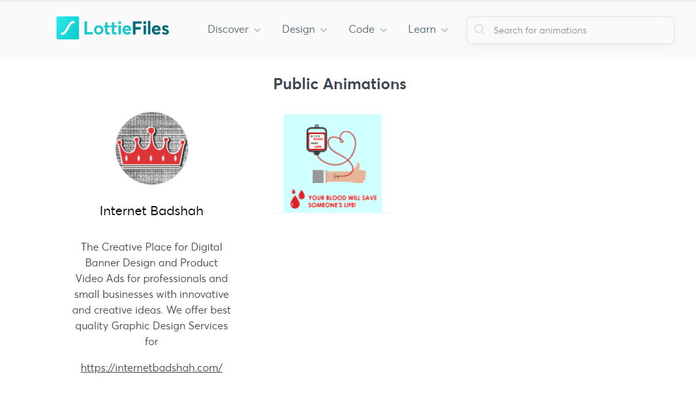

<h1>Projeto: Ajax academy doe 💓</h1>

<em><strong>ÍNDICE</strong></em>

 
 

    <a href="#objetivo" align=center>Objetivo</a>&nbsp;&nbsp;&nbsp;
    <a href="#status" align=center>Status</a>&nbsp;&nbsp;&nbsp;
    <a href="#veja" align=center>Veja o projeto</a>&nbsp;&nbsp;&nbsp; 
    <a href="#instrucoes" align=center>Instruções de instalação</a>&nbsp;&nbsp;&nbsp;
    <a href="#recursos" align=center>Linguagens & Ferramentas</a>&nbsp;&nbsp;&nbsp;
    <a href="#referencias" align=center>Referências & Créditos</a>&nbsp;&nbsp;&nbsp;
    <a href="#skills" align=center>Skills</a>&nbsp;&nbsp;&nbsp;
    <a href="#autor" align=center>Autor</a> 

 

<h3 id="objetivo">Objetivo: cria uma page de doação de sangue usando React.js</h3>

 

<h3 id="status">Status</h3> 

***Concluído*** 🚀💻

 

    <h3 id="veja">Veja o projeto 💖</h3>
     
    

 

<h3 id="instrucoes">Instruções para rodar o projeto na sua máquina</h3>

 

1 - Faça fork (clone) do projeto

2 - Abra um terminal e acesse a pasta do projeto

3 - Instale o package “node_module” com o comando ***npm install***

 

 

4 - Depois de instalado o package, digite o comando npm start ou yarn start (caso tenha o yarn instalado)

 

 

5 - Em seu navegador de preferência, digite o endereço ***http://localhost:3000***

 

 

<h3 id="recursos">Linguagens / framewoks / Bibliotecas / Ferramentas utilizadas</h3>

 

* React.js
* Node Sass
* React Icons
* React toast
* React router

 

<h2 id="skills">Skills obtidas com esse projeto</h2>

 

✔️ Noções de funcionamento e criação de um app com react

✔️ Noções de componentes

✔️ Manipulação de elementos root do React

✔️ Noções de Sass

✔️ Uso de variáveis para estilização de elementos 

✔️ Noções de arrow functions 

 

<h3 align=center id="referencias"><i>Referências e Créditos </i>📖🙋‍♂️</h3>  

Animação - [Blood Donation Animation for World Blood Donor Day
](https://lottiefiles.com/InternetBadshah) de **LottiFiles**

 

 

<h3 id="autor">Autor</h3> 

 Meu nome é Leonardo, mas gosto de ser o Leo. Estou me graduando em Sistemas de Informação. Sou Desenvolvedor Front-End (estagiário) na AjaxTI.
 

<h3 align=center><i>Gostos e Hobbies </i>📖🙋‍♂️</h3>  

Caminhar, correr, ciclismo, exercícios físicos, estudar, ler e aprender sobre desenvolvendo de sites e aplicações.
 

    <h3><strong>Contatos</strong></h3>
     
    
    &nbsp;&nbsp;&nbsp;&nbsp;&nbsp;&nbsp;&nbsp;&nbsp;&nbsp;
     
    &nbsp;&nbsp;&nbsp;&nbsp;&nbsp;&nbsp;&nbsp;&nbsp;&nbsp;
       
    &nbsp;&nbsp;&nbsp;&nbsp;&nbsp;&nbsp;&nbsp;&nbsp;&nbsp;
    

